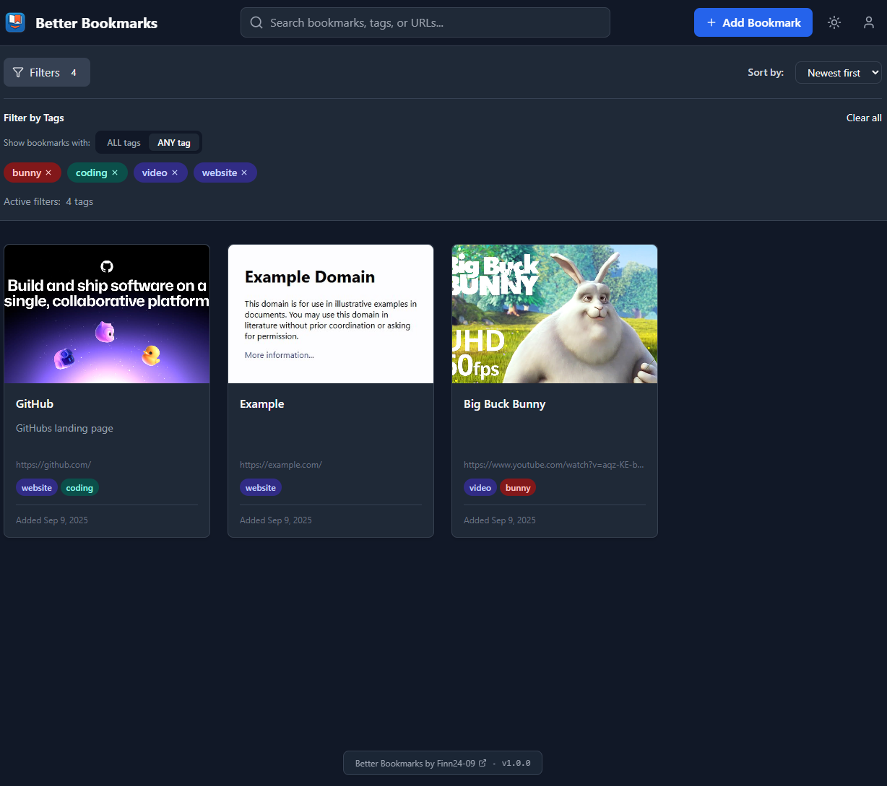

# Better Bookmarks

A modern, secure bookmark manager built with React, TypeScript, and Firebase. Organize, search, and manage your bookmarks with ease, featuring intelligent thumbnail generation and a beautiful user interface.


## 📸 Preview



_The main interface showing bookmarks with intelligent thumbnails, search functionality, and tag-based filtering_

## ✨ Features

- 🔐 **Secure Authentication** - Firebase Authentication with email/password, registration, and password recovery
- 📚 **Smart Organization** - Tag-based categorization and advanced search functionality
- 🖼️ **Intelligent Thumbnails** - Automatic screenshot generation with video thumbnail detection and smart caching
- 🌙 **Dark/Light Theme** - Beautiful UI with automatic theme detection and manual override
- 📱 **Responsive Design** - Works perfectly on desktop, tablet, and mobile devices
- ⚡ **Real-time Sync** - Cloud-based storage with Firebase Firestore
- 🔍 **Advanced Search** - Search by title, URL, description, and tags with real-time results
- 📄 **Pagination** - Efficient browsing of large bookmark collections
- 🎯 **Smart Filtering** - Filter by tags and sort by date, title, or URL
- 💾 **Offline Support** - Local caching for better performance and offline access
- 🎥 **Video Platform Support** - Intelligent thumbnail extraction for YouTube, Vimeo, Dailymotion, and Twitch
- 🔒 **Security First** - Comprehensive security features and user data isolation

## 🚀 Quick Start with Docker (Recommended)

The easiest and most reliable way to deploy Better Bookmarks is using Docker. This method ensures consistent deployment across different environments and includes all necessary security configurations.

### Prerequisites

- Docker and Docker Compose installed
- Firebase project configured (see [Firebase Setup](#-firebase-setup))
- **Better Bookmarks Scraper Service** deployed and running (see [Dependencies](#-dependencies))

### 1. Clone and Setup

```bash
git clone https://github.com/Finn24-09/better-bookmarks.git
cd better-bookmarks
```

### 2. Configure Environment

```bash
cp .env.example .env
```

Edit `.env` with your configuration:

```env
# Screenshot API Configuration (Required)
VITE_SCREENSHOT_API_URL=https://your-scraper-service.com
VITE_SCREENSHOT_API_KEY=your-api-key-here

# Firebase Configuration (Required)
VITE_FIREBASE_API_KEY=your-firebase-api-key-here
VITE_FIREBASE_AUTH_DOMAIN=your-project-id.firebaseapp.com
VITE_FIREBASE_PROJECT_ID=your-project-id
VITE_FIREBASE_STORAGE_BUCKET=your-project-id.appspot.com
VITE_FIREBASE_MESSAGING_SENDER_ID=123456789012
VITE_FIREBASE_APP_ID=1:123456789012:web:abcdef123456789012345
```

### 3. Deploy with Docker Compose

```bash
# Build and start the application
docker-compose up -d

# View logs
docker-compose logs -f better-bookmarks

# Stop the application
docker-compose down
```

The application will be available at `http://localhost:3000`

## 📋 Dependencies

### Better Bookmarks Scraper Service

This application **requires** the Better Bookmarks Scraper Service to generate website thumbnails and screenshots. The scraper service is deployed separately.

#### Scraper Service Repository

The scraper service is maintained in a separate repository: [better-bookmarks-scraper](https://github.com/Finn24-09/better-bookmarks-scraper)

#### Required Configuration

The scraper service must be deployed and accessible via the environment variables:

- `VITE_SCREENSHOT_API_URL` - The URL where your scraper service is deployed
- `VITE_SCREENSHOT_API_KEY` - API key for authentication with the scraper service

#### Fallback Behavior

If the scraper service is unavailable, the application will gracefully fallback to:

1. Platform-specific video thumbnails (YouTube, Vimeo, etc.)
2. Website favicons via Google's favicon service
3. Default placeholder images

## 🔧 Environment Variables

### Required Variables

| Variable                            | Description                        | Example                          |
| ----------------------------------- | ---------------------------------- | -------------------------------- |
| `VITE_SCREENSHOT_API_URL`           | URL of the screenshot API service  | `https://scraper.yourdomain.com` |
| `VITE_SCREENSHOT_API_KEY`           | API key for the screenshot service | `your-secure-api-key`            |
| `VITE_FIREBASE_API_KEY`             | Firebase Web API key               | `AIzaSyC...`                     |
| `VITE_FIREBASE_AUTH_DOMAIN`         | Firebase Auth domain               | `your-project.firebaseapp.com`   |
| `VITE_FIREBASE_PROJECT_ID`          | Firebase project ID                | `your-project-id`                |
| `VITE_FIREBASE_STORAGE_BUCKET`      | Firebase Storage bucket            | `your-project.appspot.com`       |
| `VITE_FIREBASE_MESSAGING_SENDER_ID` | Firebase messaging sender ID       | `123456789012`                   |
| `VITE_FIREBASE_APP_ID`              | Firebase app ID                    | `1:123456789012:web:abc...`      |

### Environment Variable Details

#### Screenshot API Configuration

- **`VITE_SCREENSHOT_API_URL`**: The base URL of your deployed better-bookmarks-scraper service. This service handles website screenshot generation and video thumbnail detection.
- **`VITE_SCREENSHOT_API_KEY`**: Authentication key for the scraper service. Ensure this matches the API key configured in your scraper service deployment.

#### Firebase Configuration

All Firebase variables are obtained from your Firebase project settings:

1. Go to Firebase Console → Project Settings → General
2. Scroll to "Your apps" section
3. Copy the configuration values to your `.env` file

## 🔧 Firebase Setup

### Complete Firebase Integration Guide

For detailed Firebase setup instructions, see [FIREBASE_SETUP.md](FIREBASE_SETUP.md).

**Quick Setup Summary:**

1. **Create Firebase Project:**

   - Go to [Firebase Console](https://console.firebase.google.com/)
   - Create a new project or select existing one

2. **Enable Services:**

   - **Authentication:** Enable Email/Password sign-in
   - **Firestore Database:** Create database in production mode
   - **Storage:** Enable Firebase Storage

3. **Configure Security Rules:**

   - Copy rules from [FIREBASE_SETUP.md](FIREBASE_SETUP.md)
   - Apply to both Firestore and Storage

4. **Get Configuration:**
   - Project Settings → General → Your apps
   - Copy Firebase config to `.env` file

### Database Structure

The application uses two main Firestore collections:

- **`bookmarks`** - User bookmarks with metadata, tags, and thumbnail information
- **`thumbnail_metadata`** - Shared thumbnail cache with deduplication to optimize storage

### Storage Structure

- **`/thumbnails/`** - Cached website screenshots and favicons organized by URL hash

## 🐳 Docker Features

### Security Features

The Docker setup includes comprehensive security best practices:

- ✅ **Multi-stage build** - Reduces final image size and attack surface
- ✅ **Non-root user** - Application runs as unprivileged nginx user
- ✅ **Read-only filesystem** - Container filesystem is read-only with specific tmpfs mounts
- ✅ **Security headers** - Comprehensive HTTP security headers via nginx
- ✅ **Health checks** - Built-in health monitoring with automatic restarts
- ✅ **Signal handling** - Proper signal handling with dumb-init
- ✅ **Minimal base image** - Alpine Linux for smaller attack surface
- ✅ **No new privileges** - Prevents privilege escalation
- ✅ **Resource limits** - CPU and memory constraints in production

### Health Monitoring

The Docker container includes comprehensive health checks:

```bash
# Check container health
docker ps

# View health check logs
docker inspect --format='{{json .State.Health}}' better-bookmarks-app

# Manual health check
curl http://localhost:3000/health
```

### Container Management

```bash
# View container logs
docker-compose logs -f better-bookmarks

# Restart the application
docker-compose restart better-bookmarks

# Update the application
docker-compose pull
docker-compose up -d

# Scale the application (production)
docker-compose -f docker-compose.yml -f docker-compose.prod.yml up -d --scale better-bookmarks=3
```

## 🏗️ Alternative Deployment Methods

### Traditional Node.js Deployment

If you prefer not to use Docker:

#### Prerequisites

- Node.js (v20 or higher)
- npm or yarn
- Firebase account
- Better Bookmarks Scraper Service deployed

#### Installation

1. **Clone and install:**

   ```bash
   git clone https://github.com/Finn24-09/better-bookmarks.git
   cd better-bookmarks
   npm install
   ```

2. **Configure environment:**

   ```bash
   cp .env.example .env
   # Edit .env with your configuration
   ```

3. **Build and serve:**
   ```bash
   npm run build
   npm run preview
   ```

### Deploy to Cloud Platforms

The built application can be deployed to various platforms:

#### Vercel

```bash
npm install -g vercel
vercel --prod
```

#### Netlify

```bash
npm run build
# Upload dist/ folder to Netlify
```

#### Firebase Hosting

```bash
npm install -g firebase-tools
firebase login
firebase init hosting
firebase deploy
```

## 🎨 Tech Stack

- **Frontend Framework:** React 19 with TypeScript
- **Build Tool:** Vite 7
- **Styling:** Tailwind CSS 4 with custom forms and utilities
- **Backend:** Firebase (Authentication, Firestore, Storage)
- **State Management:** React Context API with custom hooks
- **Icons:** Lucide React
- **Routing:** React Router DOM 7
- **Development:** ESLint 9, TypeScript 5.8
- **Deployment:** Docker with nginx, Alpine Linux
- **External Services:** Better Bookmarks Scraper Service

## 🔐 Security Features

### Application Security

- ✅ **User Isolation:** Each user can only access their own bookmarks
- ✅ **Thumbnail Security:** Users can only access thumbnails for URLs they bookmark
- ✅ **Authentication Required:** All operations require user authentication
- ✅ **Data Validation:** Comprehensive validation of uploads and metadata
- ✅ **File Type Restrictions:** Only image files allowed in storage
- ✅ **Size Limits:** 5MB maximum file size for thumbnails
- ✅ **Secure by Default:** All other access is denied

### Infrastructure Security

- ✅ **HTTPS Enforcement:** All traffic encrypted in transit
- ✅ **Security Headers:** CSP, HSTS, X-Frame-Options, etc.
- ✅ **Input Sanitization:** XSS protection and input validation
- ✅ **API Key Protection:** Environment-based configuration
- ✅ **Container Security:** Non-root execution, read-only filesystem
- ✅ **Network Isolation:** Docker network segmentation

## 📱 Features in Detail

### Intelligent Thumbnail System

- **Screenshot API Integration:** Uses the better-bookmarks-scraper service for high-quality website screenshots
- **Video Platform Detection:** Automatically detects and extracts thumbnails from YouTube, Vimeo, Dailymotion, and Twitch
- **Smart Caching:** Multi-level caching (browser → Firebase → API) with deduplication
- **Fallback Strategy:** Graceful fallback to favicons when screenshots fail
- **Format Support:** PNG and JPEG with quality control
- **Banner Handling:** Automatically handles cookie banners and popups

### Advanced Search & Filtering

- **Full-text Search:** Search across titles, URLs, descriptions, and tags
- **Tag-based Filtering:** Filter bookmarks by one or multiple tags
- **Sorting Options:** Sort by date added, title, or URL
- **Real-time Results:** Instant search results as you type
- **Pagination:** Efficient browsing of large bookmark collections
- **Empty State Handling:** Helpful guidance when no bookmarks match filters

### User Experience

- **Responsive Design:** Optimized for desktop, tablet, and mobile devices
- **Dark/Light Theme:** Automatic system theme detection with manual override
- **Toast Notifications:** User-friendly feedback for all actions
- **Loading States:** Smooth loading indicators and skeleton screens
- **Error Handling:** Graceful error handling with helpful messages
- **Accessibility:** ARIA labels and keyboard navigation support

### Authentication System

- **Email/Password Authentication:** Secure user registration and login
- **Password Recovery:** Forgot password functionality with email reset
- **Session Management:** Automatic session handling and renewal
- **Protected Routes:** Route-level authentication protection
- **User Profile:** Basic user profile management

## 🧪 Development

### Available Scripts

- `npm run dev` - Start development server with hot reload
- `npm run build` - Build for production with TypeScript compilation
- `npm run preview` - Preview production build locally
- `npm run lint` - Run ESLint with TypeScript support

### Development Setup

1. **Clone and install:**

   ```bash
   git clone https://github.com/Finn24-09/better-bookmarks.git
   cd better-bookmarks
   npm install
   ```

2. **Configure environment:**

   ```bash
   cp .env.example .env
   # Edit .env with your development configuration
   ```

3. **Start development server:**

   ```bash
   npm run dev
   ```

4. **Open browser:**
   Navigate to `http://localhost:5173`

### Development Environment Variables

For development, you can use a local instance of the scraper service:

```env
VITE_SCREENSHOT_API_URL=http://localhost:8080
VITE_SCREENSHOT_API_KEY=development-key
```

## 🆘 Support

If you encounter any issues:

1. **Check Dependencies:** Ensure the better-bookmarks-scraper service is deployed and accessible
2. **Verify Configuration:** Check that all environment variables are correctly set
3. **Firebase Setup:** Refer to [FIREBASE_SETUP.md](FIREBASE_SETUP.md) for detailed setup instructions
4. **Check Logs:** Use `docker-compose logs -f` to view application logs
5. **Browser Console:** Check the browser console for error messages
6. **Health Checks:** Verify the application health at `/health` endpoint

### Common Issues

- **Thumbnails not loading:** Check `VITE_SCREENSHOT_API_URL` and `VITE_SCREENSHOT_API_KEY` configuration
- **Authentication errors:** Verify Firebase configuration and security rules
- **Build failures:** Ensure Node.js version 20+ and clean `npm install`
- **Docker issues:** Check Docker daemon is running and ports are available

## 🙏 Acknowledgments

- Firebase for providing excellent backend services
- React team for the amazing framework
- Tailwind CSS for the utility-first CSS framework
- Lucide for the beautiful icons
- nginx for reliable web serving
- Alpine Linux for secure container base images

---

**Better Bookmarks** - Making bookmark management beautiful, intelligent, and secure.
